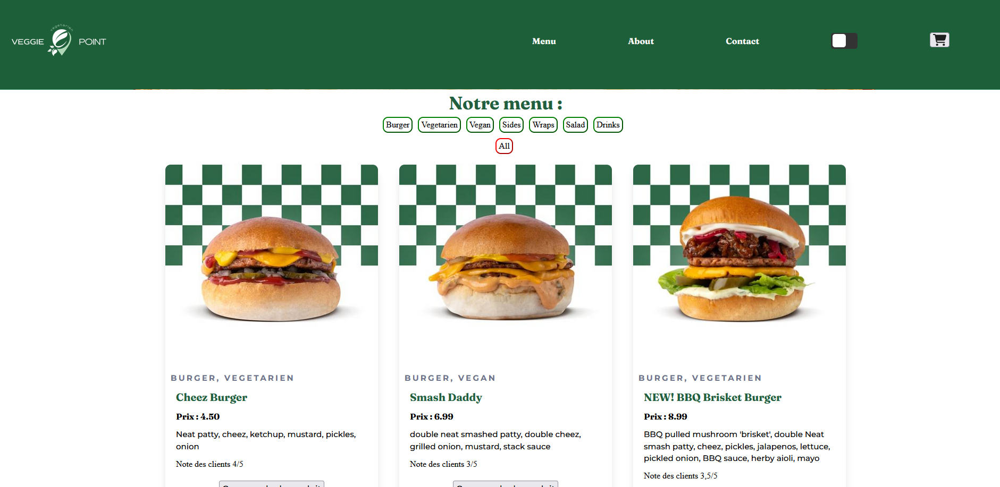
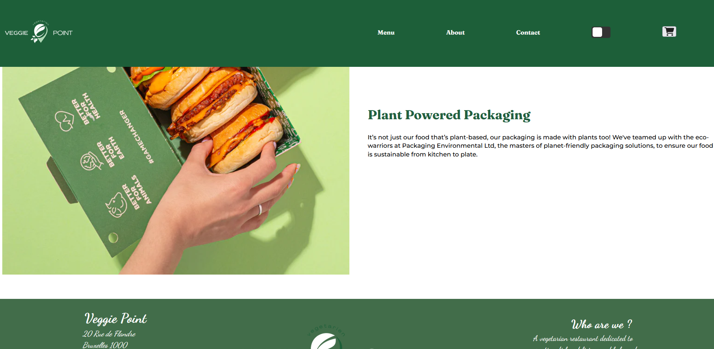

# Dark_kitchen

Les cuisines sombres, également connues sous les noms de cuisines virtuelles, cloud ou fantômes, se spécialisent dans la préparation de repas exclusivement pour la livraison. Elles opèrent sans espace de restauration physique, se concentrant uniquement sur la préparation des commandes passées via des applications de livraison ou des plateformes en ligne.

### Sommaire

1. [Description du Projet](#description)
2. [Captures d'écran](#captures-décran)
3. [Installation et Utilisation](#installation)
4. [Ressources Utilisées](#langages)

## 📌 Détails du Projet

### Description

Ce projet présente une plateforme de commandes de burgers végétariens en ligne. Les utilisateurs peuvent parcourir une sélection de délicieux burgers sans viande, ajouter au panier. De plus, il propose un mode sombre pour une expérience visuelle personnalisée.

https://dams4953.github.io/dark_kitchen/

### Captures d'Écran

## 📌 Installation et Utilisation

### Installation
1. Clonez le repo.
2. Accédez au répertoire du projet.
3. Assurez-vous d'avoir npm installés sur votre machine.
4. Assurez-vous d'avoir Sass installé. (npm install sass --save-dev).
5. L'application sera disponible sur votre localhost.

### Utilisation
- Parcourez la liste de nos burgers, salades, boissons et wraps.
- Basculez dans le mode sombre avec le bouton en haut à droite si vous le souhaiter.
- Cliquez sur "Commander le produit" pour l'ajouter au panier.
- Cliquez sur le panier en haut à droite pour voir votre commande.

## 📌 Ressources Utilisées

### Langages

## 📌 Auteurs

- [Thomas](https://github.com/Lomidou)
- [Alexis](https://github.com/JustAlex6s)
- [Damien](https://github.com/Dams4953)

